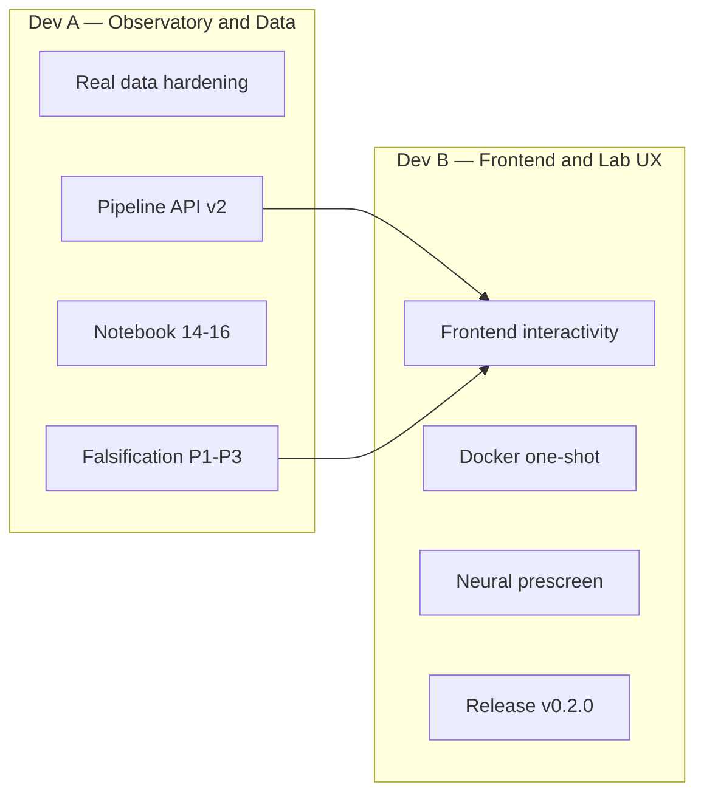

# deepiri-polomni — Roadmap

**Horizon:** ~4 weeks (2 developers, AI-assisted)  
**Target release:** `v0.2.0` — research-grade observatory + interactive multiverse lab  
**Branches:** `dev` for daily work, `main` for weekly integration  
**Last updated:** 2026-06-28

---

## Where we are (v0.1.0 shipped)

| Area | Status |
|------|--------|
| RBLE core (8 equations) | Implemented + numerical proofs (`polomni math prove` → 12/12) |
| Real data pipeline | Planck/WMAP/GWOSC fetch, cache, watch loop |
| Observatory | RBLE scan, hierarchical search, reports, null ensemble |
| API | `/health`, `/data`, `/observatory`, `/math`, `/viz`, `/metrics`, SSE GW stream |
| Frontend | Vite/React `frontend/` — 7 panels at `/app` |
| Notebooks | `experiments/01`–`13` (theory validation + real data) |
| Tests | 117+ unit tests, CI smoke on `main`/`dev` |

**Gaps that block “research paper” credibility:**

- Proofs are numerical smoke tests, not publication-grade symbolic + convergence studies
- Frontend is functional but not interactive (no simulation controls, no WebSocket live updates)
- Real-data pipeline not wired end-to-end into frontend or falsification with Bonferroni correction
- Neural layer (`polomni.neural`) and UQE bridge are stubs
- Docker does not build/serve frontend in one command
- No release tagging, changelog discipline for `v0.2.0`, or branch protection (GHAS pending)

---

## Team split (2 devs, 4 weeks)



**Sync point:** Daily 15-min standup + shared `dev` PRs. **Integration gate:** Friday week 2 and week 4 — `make verify && polomni math prove && npm run build`.

---

## Dev A — Observatory, proofs, and real data

**Owner focus:** Make RBLE falsifiable on real sky data and tighten the math story.

### Week 1 — Proof rigor + real-data bridge

| Task | Deliverable | Paths |
|------|-------------|-------|
| A1.1 Symbolic proof cells | SymPy derivations in notebooks 09–10 matching `docs/theory/` | `experiments/09_*.ipynb`, `10_*.ipynb` |
| A1.2 Stricter provers | Tolerance tables, regression baselines in `data/proofs/baselines/` | `src/polomni/math/proofs/` |
| A1.3 Real WMAP pipeline in notebook 13 | Live fetch optional via `pytest -m integration` | `experiments/13_*.ipynb`, `tests/observatory/` |
| A1.4 Bonferroni sky search | `hierarchical_search` + multiple-testing correction in reports | `src/polomni/observatory/scoring/` |

### Week 2 — Falsification trinity on real data

| Task | Deliverable | Paths |
|------|-------------|-------|
| A2.1 P1 full pipeline | String filter → Radon bifurcation → score on Planck SMICA | `observatory/filters/`, `processor.py` |
| A2.2 P2 f_NL proxy | Directed diffusion metric from district graph → inflation module link | `core/inflation/`, `integration/workflow.py` |
| A2.3 P3 GW ringdown stub | Phase correlation across conductance-linked events in GW cache | `pipeline/sources/gwosc.py`, `conductance/` |
| A2.4 `polomni falsify` CLI | Single command: run P1–P3, emit unified falsification JSON | `src/polomni/cli/commands/falsify.py` |

### Week 3 — Data pipeline v2

| Task | Deliverable | Paths |
|------|-------------|-------|
| A3.1 Parallel fetch | `concurrent.futures` or asyncio for catalog products | `pipeline/downloader.py` |
| A3.2 Stale-cache policy | Auto-refresh from `refresh_hours` + manifest TTL | `pipeline/cache.py`, `config.py` |
| A3.3 New products | Planck polarization lite, NED redshift sample (if stable URL) | `pipeline/catalog.py` |
| A3.4 API: `/data/pipeline/status` | Event log tail from `events.jsonl` | `api/routers/data.py` |

### Week 4 — Notebooks + docs for paper trail

| Task | Deliverable | Paths |
|------|-------------|-------|
| A4.1 Notebook 14 | Full real-data falsification run with figures | `experiments/14_falsification_real_data.ipynb` |
| A4.2 Notebook 15 | Power spectrum vs RBLE score correlation study | `experiments/15_cl_vs_rble.ipynb` |
| A4.3 Notebook 16 | GW–RBLE axis correlation atlas | `experiments/16_gw_rble_atlas.ipynb` |
| A4.4 Update theory cross-links | Eq numbers in notebooks ↔ `docs/theory/RBLE_MASTER_EQUATIONS.md` | `docs/theory/`, `docs/guides/` |

**Dev A exit criteria:** `polomni falsify --real` produces report with P1–P3 flags; notebooks 14–16 execute; integration tests green.

---

## Dev B — Frontend, lab UX, and release

**Owner focus:** Scientist-facing product — interactive multiverse lab, deployable stack, v0.2.0 ship.

### Week 1 — Frontend interactivity

| Task | Deliverable | Paths |
|------|-------------|-------|
| B1.1 Simulation controls | Sliders: `choices`, `districts`, `nside`; re-fetch `/viz/*` | `frontend/src/App.tsx`, `panels/` |
| B1.2 Code-split Plotly | Dynamic import; bundle &lt; 1 MB initial | `frontend/vite.config.ts` |
| B1.3 District graph edges | Plotly 3D lines for portal conductance width | `frontend/src/panels/DistrictGraph3D.tsx` |
| B1.4 Scar axis overlay | 3D arrow on orthographic globe for preferred_axis | `frontend/src/panels/ScarSphere.tsx` |

### Week 2 — Live lab + API wiring

| Task | Deliverable | Paths |
|------|-------------|-------|
| B2.1 WebSocket or SSE client | Subscribe to `/stream/gw/poll` in frontend | `frontend/src/api/`, new `LiveGWPanel.tsx` |
| B2.2 Trigger scan from UI | Button → `POST /observatory/scan` → update falsification panel | `frontend/src/api/client.ts` |
| B2.3 Report browser | List + compare from `/observatory/reports` | `frontend/src/panels/ReportBrowser.tsx` |
| B2.4 Shared types | OpenAPI → TypeScript types (or hand-written `types/api.ts`) | `frontend/src/types/` |

### Week 3 — Neural prescreen + Docker

| Task | Deliverable | Paths |
|------|-------------|-------|
| B3.1 Wire `--neural` to API | `POST /observatory/scan?neural=true` | `api/routers/observatory.py` |
| B3.2 Optional torch group | Document `poetry install --with torch`; CI matrix job (optional) | `pyproject.toml`, `.github/workflows/` |
| B3.3 Docker all-in-one | Multi-stage: `npm run build` + uvicorn serves `/app` | `docker/Dockerfile`, `docker-compose.yml` |
| B3.4 `polomni frontend dev` | Single command spawns API + Vite (subprocess manager) | `cli/commands/frontend.py` |

### Week 4 — Release v0.2.0

| Task | Deliverable | Paths |
|------|-------------|-------|
| B4.1 E2E smoke | Playwright or Cypress: load `/app`, run proofs, see panels | `frontend/e2e/` or `tests/e2e/` |
| B4.2 README + demo GIF | 30s screen capture of multiverse frontend | `README.md`, `docs/guides/frontend.md` |
| B4.3 CHANGELOG + tag | `v0.2.0` with falsification + frontend highlights | `CHANGELOG.md`, git tag |
| B4.4 API reference sync | All new routes in `docs/guides/api_reference.md` | docs |

**Dev B exit criteria:** `docker compose up` serves API + `/app`; frontend interactive; `v0.2.0` tagged on `main`.

---

## Shared backlog (either dev, as capacity allows)

| Priority | Item | Notes |
|----------|------|-------|
| P0 | Branch protection on `main` | When GHAS available on private repo |
| P1 | `deepiri-uqe` bridge | Optional ER=EPR coupling via `polomni.bridge` |
| P1 | Graph-NODE training loop | `polomni.neural.graph_node` — needs torch |
| P2 | LiteBIRD / Simons placeholder products | Catalog stubs for future maps |
| P2 | `experiments/` nbconvert in CI | Execute notebooks 01–13 headless |
| P3 | Performance: NSIDE 512 hierarchical search | Profile + cache Radon stacks |

---

## Milestone calendar

| Week | Date (approx) | Milestone | Owner |
|------|---------------|-----------|-------|
| 1 | Jul 5 | Proof baselines + interactive frontend controls | A + B |
| 2 | Jul 12 | `polomni falsify` + live GW panel in UI | A + B |
| 3 | Jul 19 | Pipeline v2 + Docker all-in-one | A + B |
| 4 | Jul 26 | Notebooks 14–16 + **v0.2.0 release** | A + B |

---

## Commands cheat sheet (for both devs)

```bash
# Daily loop
make test && poetry run polomni math prove
cd frontend && npm run dev          # :5173
poetry run polomni serve              # :8091

# Before PR
make verify
make frontend-build
poetry run polomni falsify            # after A2.4 lands

# Integration
make docker-up
open http://localhost:8091/app
```

---

## Definition of done (v0.2.0)

- [ ] All 12 math proofs pass with documented tolerances
- [ ] `polomni falsify --real` runs on cached WMAP/Planck without manual steps
- [ ] Frontend: controls + live GW + report browser
- [ ] Docker serves API + built frontend on single `docker compose up`
- [ ] Notebooks 14–16 added and referenced from README
- [ ] `CHANGELOG.md` released section for v0.2.0
- [ ] Git tag `v0.2.0` on `main`
- [ ] 140+ unit tests, CI green

---

## References

- Theory: [`docs/theory/RBLE_MASTER_EQUATIONS.md`](docs/theory/RBLE_MASTER_EQUATIONS.md)
- Falsification: [`docs/theory/FALSIFICATION_CRITERIA.md`](docs/theory/FALSIFICATION_CRITERIA.md)
- Data pipeline: [`docs/architecture/DATA_PIPELINE.md`](docs/architecture/DATA_PIPELINE.md)
- Frontend: [`docs/guides/frontend.md`](docs/guides/frontend.md)
- Math plan: [`docs/architecture/MATH_STUDIO_PLAN.md`](docs/architecture/MATH_STUDIO_PLAN.md)
