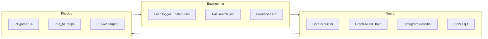

# Physics & Neural Roadmap — From Lab to Proven Science

**Status:** Active plan  
**Last updated:** 2026-06-30  
**Prerequisite:** Closed RBLE loop (sim → CMB imprint → scan → feedback) merged

This document is the execution path from **computational lab** → **data-driven neural layer** → **observational physics claim**. It complements [PHYSICS_ESTABLISHMENT.md](./PHYSICS_ESTABLISHMENT.md) (peer-review gates) with engineering and research tracks.

---

## North star

> RBLE becomes **proven physics** when a pre-registered observational claim (P1 CMB Radon scar) survives blind holdout **and** the closed simulation loop independently predicts the same axis/statistic class on synthetic + real data — with neural layers trained on logged district history, not hand-tuned heuristics.

---

## Phase 0 — Done / in flight (PR #3+)

| Deliverable | Status |
|-------------|--------|
| Closed loop: district → CMB imprint → RBLE scan → feedback | ✅ |
| Path C stubs: inflation patches, Graph-NODE train, PINN loss, GW, UQE | ✅ |
| Frontend closed-loop panel | 🔄 this PR |
| Axis search optimization (cached filter, pixel Radon) | 🔄 this PR |

---

## Phase 1 — Instrument the loop (2–3 weeks)

**Goal:** Every loop run produces a **dataset row**, not just a console line.

### 1.1 Loop telemetry schema

Log to `data/loop_runs/{run_id}.json`:

```json
{
  "run_id": "uuid",
  "git_sha": "...",
  "steps": [{ "true_axis", "recovered_axis", "axis_error_deg", "rble_score", "deff_mean", "fnl_range" }],
  "graph_snapshot": "...",
  "policy": "axis_biased",
  "nside": 32
}
```

**Paths:** `integration/loop_logger.py`, hook in `run_closed_loop`

### 1.2 Real-data bridge

- Run same RBLE axis search on **cached WMAP/Planck** after each synthetic loop step
- Store `axis_agreement_deg(synthetic, real_map)` — does simulation scar axis align with real-sky preferred axis?
- **Exit:** Notebook `20_synthetic_vs_real_axis.ipynb`

### 1.3 Frontend + API

- Closed-loop panel (steps, policy, convergence plot) ✅
- Export run JSON from `GET /viz/closed-loop?download=1`

---

## Phase 2 — Neural layer on real loop data (3–4 weeks)

**Goal:** Graph-NODE and scar classifier **trained on logged jumps**, not random MLP nudges.

### 2.1 Dataset builder

| Source | Label |
|--------|-------|
| District graph jump history | Next-branch weights, coordinate delta |
| Loop step (true vs recovered axis) | Axis error, conductance update |
| CMB imprint + scan | Tomogram fingerprint (Eq. 6 integral, bifurcation peaks) |

**Paths:** `neural/datasets/loop_corpus.py`, `data/neural/corpus/`

### 2.2 Graph-NODE training (torch required)

1. `poetry install --with torch`
2. Export 1k+ loop runs (batch CLI: `polomni run closed-loop --steps 5 --batch 200`)
3. Train `RBLEGraphEngine` to predict:
   - Next parent coordinate after feedback
   - Branch weights from axis_biased policy residual
4. **Metric:** MSE on branch weights + axis error reduction vs untrained baseline

### 2.3 Scar classifier (CNN on tomogram)

- Input: Radon tomogram `(η, |R|)` from `build_radon_tomogram`
- Label: injected axis (from simulation) or recovered axis (from real data)
- Use for **prescreen** before full hierarchical search (speed + neural Phase 3)

### 2.4 PINN Eq. 1 — proper loss

Replace proxy residual with:
- Automatic differentiation of metric ansatz
- `modified_field_residual` on collocation points
- Couple choice entropy → `I_μν` spike at horizon

**Exit:** `polomni neural train --corpus data/neural/corpus/` CLI

---

## Phase 3 — Adapt to real physics (4–8 weeks)

**Goal:** Connect loop outputs to **observational falsification** (P1–P3).

### 3.1 P1 — CMB (primary physics gate)

Follow [PHYSICS_ESTABLISHMENT.md](./PHYSICS_ESTABLISHMENT.md) Gates 1–4:

1. Pre-registration frozen (`study-p1-v1.0`)
2. Injection recovery @ SNR≥3
3. Null tiers N0/N1/N2
4. Blind Planck holdout

**Neural role:** Tomogram prescreen + axis landscape (`rble_axis_landscape`) — **not** post-hoc tuning.

### 3.2 P2 — Inflation / f_NL

- Map `D_eff` patches from simulation → compare spatial structure to real bispectrum proxies
- Neural: predict local f_NL from district graph geodesic distance

### 3.3 P3 — GW conductance

- Replace synthetic ringdown with O4 catalog adapter
- Test linked vs unlinked phase correlation (threshold in FALSIFICATION_CRITERIA)

### 3.4 Closed loop ↔ real sky feedback

```
Real map scan → preferred_axis_real
  → bias next district simulation (ChoicePolicy.AXIS_BIASED)
  → imprint synthetic CMB
  → measure if loop pulls synthetic axis toward real axis
```

This is the **hybrid physics test**: simulation adapts to observational prior.

---

## Phase 4 — Proven physics package (ongoing)

| Milestone | Criterion |
|-----------|-----------|
| **4a Methods** | arXiv: pipeline + null tests, no discovery claim |
| **4b Holdout** | Planck blind run logged, Bonferroni + TE check |
| **4c Replication** | Docker reproduce; external team matches JSON |
| **4d Neural appendix** | Graph-NODE improves axis recovery vs baseline on injection suite |
| **4e Accepted paper** | Peer-reviewed P1 result or honest null |

**Physics credibility score** (from PHYSICS_ESTABLISHMENT): target **70/100** after 4b, **90/100** after 4c+4e.

---

## Workstreams (parallel)



| Track | Owner focus | Next 2 tasks |
|-------|-------------|--------------|
| **Eng** | Loop speed + UX | Merge perf PR; loop JSON logger |
| **ML** | Data from loops | Batch 500 runs; corpus export |
| **Phys** | P1 protocol | Complete null tiers in falsify CLI; holdout runner |

---

## Immediate next actions (this week)

1. Merge frontend + axis-search optimization PR
2. Add `polomni run closed-loop --batch N` for corpus generation
3. Implement `loop_logger.py` and document schema in `docs/architecture/LOOP_TELEMETRY.md`
4. Start notebook `20_synthetic_vs_real_axis.ipynb`
5. Schedule P1 Gate 2 injection recovery CI on every PR

---

## What we stop doing

- Claiming σ without Bonferroni / holdout
- Training neural nets without logged loop corpus
- Leading papers with multiverse narrative before P1 passes Gate 4

---

## Related docs

- [PHYSICS_ESTABLISHMENT.md](./PHYSICS_ESTABLISHMENT.md) — observational gates
- [FALSIFICATION_CRITERIA.md](./theory/FALSIFICATION_CRITERIA.md) — P1–P3 definitions
- [ROADMAP.md](../ROADMAP.md) — v0.2.0 product engineering
