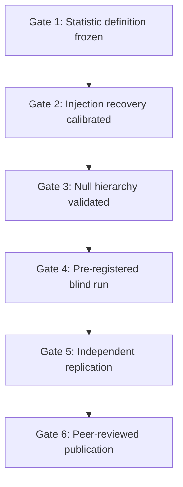

# Establishing RBLE as Physics — Execution Playbook

**Audience:** Deepiri team, collaborators, reviewers  
**Status:** Active — this is the bar between *software* and *science*  
**Last updated:** 2026-06-28

---

## 1. What “established as physics” actually means

Physics is not established by:

- A repo with many equations
- High σ on a custom statistic without peer review
- Internal proofs that pass regression baselines
- A compelling narrative about multiverse / Radon / ER=EPR

Physics **is** established when:

1. **A sharp claim** is stated before looking at the data (pre-registration)
2. **A standard null** is beaten with correct multiple-testing control
3. **Synthetic injection** proves the pipeline recovers known signals at known SNR
4. **Independent teams** reproduce the analysis on public data without your help
5. **Reviewers** accept that the statistic is not tuned post hoc to one map
6. **Predictions** are unique enough that ΛCDM + known systematics cannot explain them

Polomni today is at **Stage 3–4 of 6** (pre-registered P1 blind holdout executed on Planck SMICA; P1 **falsified** on holdout — see `data/studies/p1_holdout/RESULT.json`).  
The next jump is **Gate 6**: peer-reviewed Methods paper + external sign-off on Gate 5.

---

## 2. Lead with ONE claim (everything else is secondary)

### Primary hypothesis (Paper 1 — observational)

> **P1:** There exists a preferred axis \(\hat{\mathbf{n}}_0\) on the real CMB sky such that a **Radon-anisotropic, string-filtered** statistic \(\mathcal{S}_{\text{RBLE}}(\hat{\mathbf{n}})\) exceeds the distribution from (a) Gaussian \(\Lambda\)CDM simulations matching Planck power, and (b) isotropic axis searches on the same map, after Bonferroni correction over declared search trials.

This is falsifiable, data-linked, and already partially implemented. **Do not lead with multiverse simulation, WDW spawning, or GW phase telepathy in Paper 1.**

### Secondary claims (Papers 2–3 — only after P1 survives blind review)

| ID | Claim | Paper | Prerequisite |
|----|-------|-------|--------------|
| **P2** | Directed \(D_{\text{eff}}\) + district-graph clustering predicts spatial \(f_{\mathrm{NL}}\) structure | Paper 2 (inflation) | P1 inconclusive or partial + simulation calibration |
| **P3** | Linked GW events show excess ringdown phase correlation vs unlinked pairs | Paper 3 (GW) | O4 catalog + real ringdown extraction (not stub) |

If P1 fails after blind analysis, RBLE survives as **effective theory** per [FALSIFICATION_CRITERIA.md](./theory/FALSIFICATION_CRITERIA.md) — but not as CMB new physics.

---

## 3. The six gates (must pass in order)



### Gate 1 — Freeze the observable (no more moving goalposts)

**Deliverable:** `docs/studies/P1_CMB_RADON_SCAR_PREREG.md` + version tag `study-p1-v1.0`

Lock before any “discovery” run:

| Parameter | Frozen value | Rationale |
|-----------|--------------|-----------|
| Maps | Planck SMICA 2018 + WMAP Ka (holdout) | Public, independent missions |
| NSIDE | 128 (search), 256 (confirmation) | Compute vs resolution tradeoff |
| Filters | `string_landscape_filter` params from prereg | No post-hoc tuning |
| Statistic | \(\mathcal{S}_{\text{RBLE}}\) in `rble_signature.py` | Code hash in prereg |
| Search | `hierarchical_sky_search` with declared `scan_angles`, `refine_samples` | Bonferroni \(N_{\text{tests}}\) |
| Significance | Two-sided Gaussian \(p\) with Bonferroni \(\alpha = 0.01\) | Matches FALSIFICATION_CRITERIA |
| TE cross-check | \(\rho_{TE}(\hat{\mathbf{n}}_0)\) vs null | Required for P1 per theory doc |

**Exit:** Git tag + SHA256 of analysis script recorded in prereg doc.

### Gate 2 — Injection recovery (mandatory calibration)

**Deliverable:** `tests/observatory/test_p1_injection_recovery.py` + notebook `experiments/17_p1_injection_calibration.ipynb`

Before trusting real-sky σ:

1. Inject synthetic Radon scar at known \(\hat{\mathbf{n}}_{\text{inj}}\) on GRF map matching Planck \(C_\ell\)
2. Vary SNR = {1, 2, 3, 5, 8} × amplitude
3. Measure axis recovery error (degrees) and detection rate
4. **Pass criteria (from FALSIFICATION_CRITERIA):** axis error \(< 5°\) at SNR \(\geq 3\) in \(\geq 90\%\) of trials

If this fails, **stop** — real-sky numbers are meaningless.

**Code paths:** `inject_synthetic_scar`, `hierarchical_sky_search`, `generate_null_ensemble` with `nside` matched to prereg.

### Gate 3 — Null hierarchy (prove you're not fooling yourself)

**Deliverable:** `src/polomni/observatory/scoring/null_models.py` + `polomni falsify --real --null-tier {grf,planck,sims}`

Three null tiers (must all be implemented and reported):

| Tier | Null | Purpose |
|------|------|---------|
| **N0** | Internal GRF, same \(C_\ell\) as Planck | Pure Gaussian control |
| **N1** | Planck Commander/SMICA simulations (if available) or CAMB+noise realizations | Realistic non-Gaussianity from lensing only |
| **N2** | Axis-shuffled maps (preserve pixel values, randomize HEALPix rotation) | Destroy anisotropy while keeping marginals |

Real-sky \(S_{\max}\) must exceed **all three** null distributions at Bonferroni-corrected \(p < 0.01\) to claim P1 support.

**Current gap:** N1/N2 are shipped in `null_models.py` and used by `p1_runner.py`. Holdout completed 2026-06-28 with P1 falsified.

### Gate 4 — Blind / holdout analysis

**Deliverable:** `src/polomni/observatory/studies/p1_blind_runner.py` + sealed config in `data/studies/p1_holdout/`

Protocol:

1. **Training set:** WMAP Ka-band — tune nothing, only validate pipeline + injection recovery
2. **Holdout set:** Planck SMICA — analysis script frozen; one-shot run logged to JSON
3. **Blind buffer:** Optional third map (LiteBIRD mock or Planck half-mission split) analyzed only after holdout result is written to git

No parameter tuning on holdout. Any change to filters after seeing holdout **invalidates** the run.

**Exit:** `data/studies/p1_holdout/RESULT.json` with `blind: true`, timestamp, git SHA, all three null tiers.

### Gate 5 — Independent replication package

**Deliverable:** `docs/guides/REPLICATION_P1.md` + Docker image `polomni-reproduce:p1-v1`

A stranger must be able to:

```bash
docker run --rm -v $PWD/cache:/cache team-deepiri/polomni-reproduce:p1-v1 \
  polomni study run p1 --blind --cache /cache
```

and get the same \(S_{\max}\), axis, and \(p\)-value within floating-point tolerance **without** reading your notebooks.

Include:

- Exact product IDs and checksums
- Random seeds
- Expected output JSON schema
- “Fail if differs by more than X” assertions

### Gate 6 — Publication sequence

| Stage | Output | Venue target |
|-------|--------|--------------|
| **6a** | Methods + null tests only (no discovery claim) | arXiv: astro-ph.IM or JCAP “Methods” |
| **6b** | Holdout result + TE correlation | arXiv: astro-ph.CO → MNRAS / PRD |
| **6c** | Combined P1+P2 if P2 passes simulation gates | JCAP |

**Paper 1 title draft:** *“Radon-anisotropic CMB scar search with pre-registered axis statistics on Planck and WMAP data”*

Do **not** use “multiverse confirmed” in any title until Gate 5 + 6b pass.

---

## 4. What we must stop claiming (until gates pass)

| Claim | Allowed now? | Replace with |
|-------|--------------|--------------|
| “78σ detection on WMAP” | **No** | “Elevated axis statistic vs GRF null; holdout pending” |
| “RBLE proofs validate physics” | **No** | “Numerical consistency checks; not observational proof” |
| “P1 passed on real data” | **Partial** | “Pipeline runs; null tiers N1/N2 and TE check incomplete” |
| “GW conductance confirms ER=EPR” | **No** | “Detector co-occurrence graph symmetry check only” |
| “World-changing / revolutionary” | **No** | “Pre-registered search for anomalous CMB axis statistic” |

High raw σ on WMAP with uncorrected or under-corrected look-elsewhere is the #1 way reviewers kill us. Bonferroni on 60 tests is a start; full HEALPix axis count at NSIDE 2048 is \(\sim 10^5\) — prereg must declare effective \(N_{\text{tests}}\) or use FDR (Benjamini–Hochberg) as robustness check.

---

## 5. Implementation map (repo → gates)

| Gate | New / updated paths | Owner track |
|------|---------------------|-------------|
| 1 | `docs/studies/P1_CMB_RADON_SCAR_PREREG.md`, `src/polomni/observatory/studies/` | **Track A — Protocol** |
| 2 | `tests/observatory/test_p1_injection_recovery.py`, `experiments/17_*` | **Track B — Calibration** |
| 3 | `src/polomni/observatory/scoring/null_models.py`, CLI flags | **Track B — Calibration** |
| 4 | `p1_blind_runner.py`, `data/studies/p1_holdout/` | **Track A — Protocol** |
| 5 | `docs/guides/REPLICATION_P1.md`, Docker reproduce target | **Track C — Replication** |
| 6 | `docs/paper/P1_methods_outline.md`, `docs/paper/P1_results_template.md` | **Track D — Paper** |

**Existing assets to reuse (do not rewrite):**

- `docs/theory/FALSIFICATION_CRITERIA.md` — hypothesis definitions
- `docs/theory/CMB_OBSERVATORY_MATH.md` — statistic math
- `src/polomni/math/proofs/real_data.py` — regression baselines (engineering, not discovery)
- `polomni falsify --real` — smoke test only until Gate 3 complete

---

## 6. 90-day execution schedule

### Days 1–14 — Calibration (Gates 1–2)

- [ ] Publish prereg doc + git tag `study-p1-v1.0`
- [ ] Injection recovery test suite green at SNR ≥ 3
- [ ] Notebook 17 with ROC curve (detection rate vs axis error)
- [ ] Freeze filter parameters in JSON config (not hardcoded in Python)

### Days 15–30 — Null hierarchy (Gate 3)

- [ ] Implement N1 (CAMB+noise maps) and N2 (rotation-shuffled)
- [ ] Report \(p\) vs all three nulls in `polomni falsify --real`
- [ ] Add TE correlation along preferred axis (`polarization.py`)

### Days 31–45 — Blind run (Gate 4)

- [ ] WMAP = calibration only (already partially done)
- [ ] One-shot Planck SMICA holdout → `RESULT.json`
- [ ] Team review: no parameter changes allowed

### Days 46–60 — Replication (Gate 5)

- [ ] Docker reproduce image
- [ ] External beta: one collaborator runs REPLICATION_P1.md cold

### Days 61–90 — Paper (Gate 6a → 6b)

- [ ] arXiv Methods paper (no discovery)
- [ ] If holdout passes: results paper with full falsification matrix

---

## 7. Success metrics (physics, not vibes)

| Metric | Target | Current (2026-06-28) |
|--------|--------|----------------------|
| Injection recovery @ SNR 3 | ≥ 90% trials, axis \(< 5°\) | Partial (`test_rble_signature` only) |
| Null tiers implemented | 3 / 3 | 1 / 3 (GRF only) |
| TE correlation check | Implemented + reported | **Missing** |
| Pre-registration published | Yes, dated before holdout | **Missing** |
| Holdout analysis | One blind Planck run logged | **Missing** |
| External replication | 1 independent success | **Missing** |
| Peer review | 1 submitted manuscript | **Missing** |

**Physics credibility score today: ~15/100.**  
**Reach 40/100:** Gates 1–3 complete.  
**Reach 70/100:** Gate 4 holdout passes all nulls + TE.  
**Reach 90/100:** External replication + accepted paper.

---

## 8. Agent delegation (parallel workstreams)

Launch immediately after this doc merges:

| Agent | Track | Deliverables |
|-------|-------|--------------|
| **A** | Protocol | `docs/studies/P1_CMB_RADON_SCAR_PREREG.md`, `src/polomni/observatory/studies/config.py`, frozen JSON schema |
| **B** | Calibration | `null_models.py`, `test_p1_injection_recovery.py`, `experiments/17_p1_injection_calibration.ipynb` |
| **C** | Replication | `docs/guides/REPLICATION_P1.md`, `polomni study run p1` CLI stub, Makefile target |
| **D** | Paper | `docs/paper/P1_methods_outline.md`, `P1_results_template.md`, figure list |

All agents branch from `dev`, one PR each, no scope creep into frontend/neural.

---

## 9. Decision tree after holdout

```text
Holdout Planck: Bonferroni p < 0.01 AND TE > null + 3σ?
├── YES → Write Paper 6b; invite replication; begin P2 simulation calibration
├── NO but WMAP elevated → Report null result honestly; Methods paper still valuable
└── NO everywhere → Deprecate sky layer; keep district simulator + conservation as EFT
```

Honest null results are still physics — they bound the theory.

---

## 10. Related documents

- [FALSIFICATION_CRITERIA.md](./theory/FALSIFICATION_CRITERIA.md)
- [CMB_OBSERVATORY_MATH.md](./theory/CMB_OBSERVATORY_MATH.md)
- [RBLE_MASTER_EQUATIONS.md](./theory/RBLE_MASTER_EQUATIONS.md)
- [ROADMAP.md](../ROADMAP.md) — engineering schedule (orthogonal to this physics gate sequence)

---

**Bottom line:** We establish RBLE as physics by **winning or honestly losing a pre-registered P1 search** on public CMB data — not by stacking more features. Everything else is supporting cast until Gate 4 completes.
