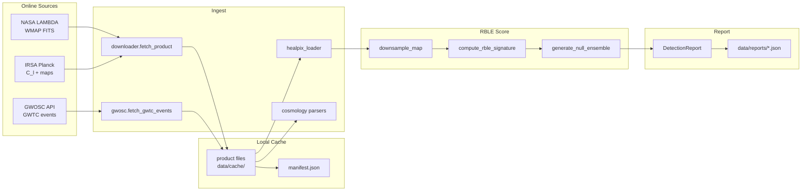
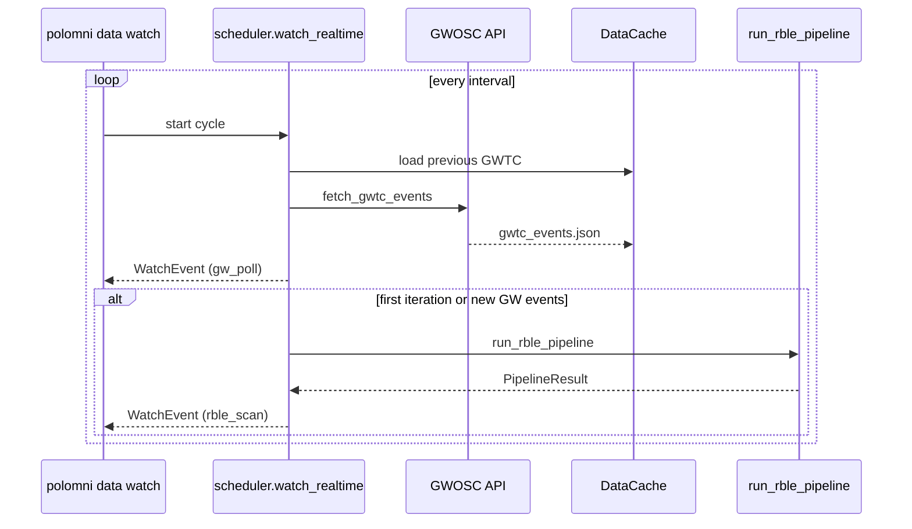

# Data Pipeline Architecture

Architecture for the real-data RBLE observatory pipeline: online sources, filesystem cache, ingest, scoring, and detection reports.

**Implementation root:** `src/polomni/observatory/pipeline/`

---

## Flow Diagram

---

## Watch Loop (Real-Time)

---

## Component Table

| Component | Module | Responsibility |
|-----------|--------|----------------|
| **Catalog** | `pipeline/catalog.py` | Canonical product IDs, URLs, tiers, refresh policy |
| **Cache** | `pipeline/cache.py` | Filesystem layout, `manifest.json`, freshness checks |
| **Downloader** | `pipeline/downloader.py` | HTTP fetch, conditional re-download, cache recording |
| **GWOSC source** | `pipeline/sources/gwosc.py` | GWTC JSON API, event diffing, snapshot model |
| **Cosmology source** | `pipeline/sources/cosmology.py` | Planck C_l parsers, Ω_Λ proxy |
| **Processor** | `pipeline/processor.py` | `ingest_standard_data`, `run_rble_pipeline` |
| **Scheduler** | `pipeline/scheduler.py` | `watch_realtime` poll loop, optional re-scan |
| **CLI** | `pipeline/cli_commands.py` | `polomni data list|status|fetch|pipeline|watch` |
| **HEALPix loader** | `observatory/ingest/healpix_loader.py` | FITS load, downsample, synthetic maps |
| **RBLE scorer** | `observatory/scoring/rble_signature.py` | `compute_rble_signature`, `DetectionReport` |
| **Null ensemble** | `observatory/scoring/null_ensemble.py` | Gaussian null maps for σ estimate |
| **Reports** | `observatory/reports/detection_report.py` | `format_report`, `save_json` |
| **REST data routes** | `api/routers/data.py` | `/data/catalog`, `/data/status`, `/data/fetch`, `/data/gw/events` |
| **REST observatory** | `api/routers/observatory.py` | `/observatory/scan`, `/observatory/pipeline`, `/observatory/reports` |
| **SSE stream** | `api/routers/stream.py` | `/stream/gw/poll` |
| **Lab workflow** | `integration/workflow.py` | `run_lab_workflow` — ingest + simulation + pipeline |

---

## Data Tiers

| Tier | Products | Typical use |
|------|----------|-------------|
| **lite** | Planck TT power, ΛCDM baseline | Calibration, power spectrum plots, always fetched |
| **standard** | WMAP K-band, Planck mask | Default real-sky RBLE scans (~100 MB) |
| **heavy** | Planck SMICA 2048 | Production-resolution scans (~384 MB) |
| **real-time** | GWTC events | Polling, ringdown cross-checks (JSON API) |

---

## Report Schema

Detection reports (`DetectionReport`) serialize to JSON under `data/reports/`:

| Field | Description |
|-------|-------------|
| `rble_score` | Peak RBLE signature value |
| `preferred_axis` | Best-fit scan axis on S² |
| `null_sigma` | Significance vs null ensemble |
| `falsification_flags` | P1/P2/P3 stub flags |
| `metadata` | Map RMS, NPIX, etc. |
| `timestamp` | UTC scan time |

---

## Integration Points

| Surface | Entry |
|---------|-------|
| CLI | `polomni data pipeline`, `polomni scan --real` |
| REST | `POST /observatory/pipeline` |
| Lab workflow | `polomni run workflow` via `integration/workflow.py` |
| Notebook | `experiments/07_real_data_pipeline.ipynb` |

---

## Related

- [../guides/real_time_data.md](../guides/real_time_data.md) — operator guide
- [../guides/api_reference.md](../guides/api_reference.md) — HTTP API
- [SYSTEM_OVERVIEW.md](./SYSTEM_OVERVIEW.md) — full system architecture
