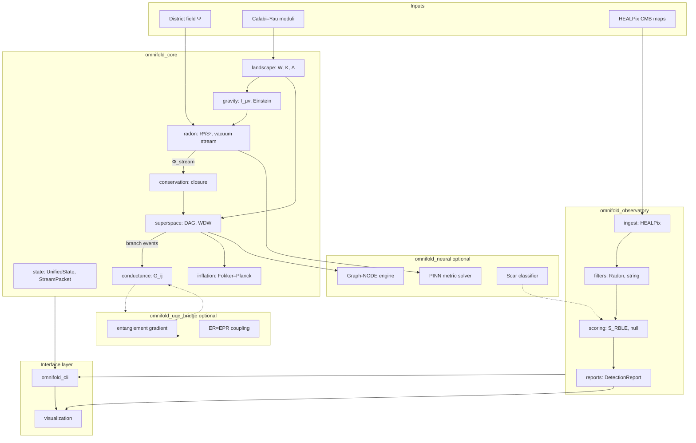

# Deepiri Omnifold — System Overview

Architecture of **deepiri-omnifold**: the RBLE (Radon-Bifurcated Landscape Engine) research stack for choice-driven multiverse simulation and CMB falsification.

**Theory:** [../theory/RBLE_MASTER_EQUATIONS.md](../theory/RBLE_MASTER_EQUATIONS.md) · **Notation:** [../theory/NOTATION.md](../theory/NOTATION.md)

---

## Vision

A closed computational cosmology loop:

> District compresses state → streams through graviton well → births superspace wavepackets → perturbs inflation → imprints CMB sky → (optionally) leaks via ER bridges → stabilizes moduli → repeat.

Every stage enforces **stream–entropy closure**:

$$
\oint_{\mathcal{H}} \Phi_{\text{stream}} \cdot dA = \mathrm{Tr}(I_{\mu\nu}^{(N)} I^{(N)\,\mu\nu})
$$

(`omnifold_core/conservation.py`)

---

## Package Architecture



---

## Module Map

### `omnifold_core/` — Deterministic physics engine

| Subpackage | Responsibility | Key files |
|------------|----------------|-----------|
| `state/` | Unified state $\mathbf{\Psi}$, packets | `unified_state.py`, `stream_packet.py`, `choice_event.py` |
| `landscape/` | String vacuum | `kahler.py`, `superpotential.py`, `vacuum_energy.py` |
| `gravity/` | Modified Einstein | `information_tensor.py`, `field_equations.py`, `schwarzschild_choice.py` |
| `inflation/` | Eternal inflation PDF | `fokker_planck.py`, `drift_diffusion.py` |
| `superspace/` | District graph, WDW | `district_graph.py`, `branch_operator.py`, `wdw_generator.py`, `particle_langevin.py` |
| `radon/` | Encapsulate–rotate–stream | `transform_r3.py`, `transform_s2.py`, `so3_rotation.py`, `vacuum_stream.py` |
| `conductance/` | ER=EPR network | `bridge_tensor.py`, `master_equation.py` |
| `conservation.py` | Closure enforcement | `enforce_stream_entropy_closure`, `stream_flux_integral` |

### `omnifold_observatory/` — Sky validation

| Subpackage | Key files |
|------------|-----------|
| `ingest/` | `healpix_loader.py`, `polarization.py` |
| `filters/` | `radon_bifurcation.py`, `string_filter.py` |
| `scoring/` | `rble_signature.py`, `null_ensemble.py` |
| `reports/` | `detection_report.py` |

### `omnifold_neural/` — Optional AI acceleration (`poetry install -E torch`)

| Subpackage | Key files |
|------------|-----------|
| `graph_node/` | `engine.py`, `jump_predictor.py` |
| `pinn/` | `metric_solver.py` |
| `scar_classifier/` | `rble_scanner.py` |

### `omnifold_uqe_bridge/` — Optional UQE integration (`poetry install -E uqe`)

| File | Role |
|------|------|
| `entanglement.py` | `cross_branch_gradient` |
| `er_epr_coupling.py` | `map_density_to_conductance` |

### `omnifold_cli/` — Typer CLI

| Command | Module |
|---------|--------|
| `omnifold simulate` | `commands/simulate.py` |
| `omnifold scan` | `commands/scan.py` |
| `omnifold-serve` | `commands/serve.py` |

### `visualization/`

| File | Output |
|------|--------|
| `sky_map.py` | Mollweide CMB overlay |
| `district_graph_viz.py` | NetworkX DAG plot |
| `stream_pipeline_viz.py` | Radon pipeline stages |

---

## Data Spine: StreamPacket

Every choice event produces a Pydantic `StreamPacket`:

| Field | Physics |
|-------|---------|
| `phi_stream` | $\Phi_{\text{stream}}$ |
| `information_trace` | $\mathrm{Tr}(I^2)$ |
| `branch_weights` | $p_k$ |
| `num_choices` | $N$ |
| `district_id`, `parent_id` | Graph indices |

Flows: `DistrictGraph` → `RadonVacuumPipeline` → `WDWGenerator` → `fokker_planck` / `observatory`.

---

## Simulation Loop (Integration)

```
1. DistrictGraph.add_district(...)           # seed sector 0
2. DistrictGraph.trigger_choice_event(N)     # spawn N children
3. BranchOperator.split_state_vector         # mutate Ψ per branch
4. information_tensor_N(N, ...)              # build I_μν
5. RadonVacuumPipeline → StreamPacket        # encapsulate, rotate, stream
6. conservation.enforce_stream_entropy_closure
7. WDWGenerator.inject_stream(packet)        # N wavepackets
8. fokker_planck_step with D_eff             # directed inflation
9. conductance_matrix + district_master_step # network evolution
```

**Test:** `tests/integration/test_full_loop.py`

---

## Observatory Loop

```
1. load_healpix_map(fits_path)
2. extract_qu_maps(T_map)
3. string_landscape_filter + inverse_radon_bifurcation_filter
4. compute_rble_signature(map, n_hat)
5. compare to generate_null_ensemble
6. format_report → JSON + sky_map overlay
```

**Test:** `tests/observatory/test_rble_signature.py`

---

## Technology Stack

| Dependency | Purpose |
|------------|---------|
| numpy, scipy, sympy | Field equations, Radon, symbolic $W$ |
| networkx | District DAG |
| pydantic v2 | Schemas |
| typer, rich | CLI |
| healpy, astropy | CMB FITS / HEALPix |
| matplotlib, plotly | Visualization |
| torch (optional) | Neural modules |
| deepiri-uqe (optional) | Entanglement bridge |

**Build:** Poetry — `pyproject.toml` at repo root.

---

## Repository Layout

```
deepiri-omnifold/
├── omnifold_core/           # Physics engine
├── omnifold_observatory/    # CMB validation
├── omnifold_neural/         # Optional ML
├── omnifold_uqe_bridge/     # Optional UQE
├── omnifold_cli/            # CLI
├── visualization/           # Plots
├── experiments/             # Jupyter notebooks 01–06
├── docs/
│   ├── theory/              # Canonical math (this suite)
│   ├── guides/              # How-to
│   └── architecture/        # This document
├── tests/
│   ├── unit/
│   ├── integration/
│   └── observatory/
└── docker/                  # omnifold-lab
```

---

## Phased Delivery

| Phase | Deliverable |
|-------|-------------|
| 0 — Scaffold | Repo, conservation tests, theory docs |
| 1 — Simulation | Full loop CLI, notebooks 01–04 |
| 2 — Observatory | HEALPix scan, synthetic scar recovery |
| 3 — Neural | Graph-NODE, PINN, scar CNN |
| 4 — UQE bridge | ER=EPR from density matrices |

---

## Falsification Integration

`DetectionReport.falsification_flags` tracks three predictions (see [../theory/FALSIFICATION_CRITERIA.md](../theory/FALSIFICATION_CRITERIA.md)):

1. Radon-anisotropic CMB scars
2. Clustered $f_{\mathrm{NL}}$ along district graph
3. GW ringdown phase correlations (future)

---

## Related Documents

| Topic | Path |
|-------|------|
| Eight master equations | [../theory/RBLE_MASTER_EQUATIONS.md](../theory/RBLE_MASTER_EQUATIONS.md) |
| Variational action | [../theory/VARIATIONAL_PRINCIPLE.md](../theory/VARIATIONAL_PRINCIPLE.md) |
| Getting started | [../guides/getting_started.md](../guides/getting_started.md) |
| Simulations | [../guides/running_simulations.md](../guides/running_simulations.md) |
| CMB pipeline | [../guides/cmb_data_pipeline.md](../guides/cmb_data_pipeline.md) |
| UQE bridge | [../guides/uqe_bridge.md](../guides/uqe_bridge.md) |
